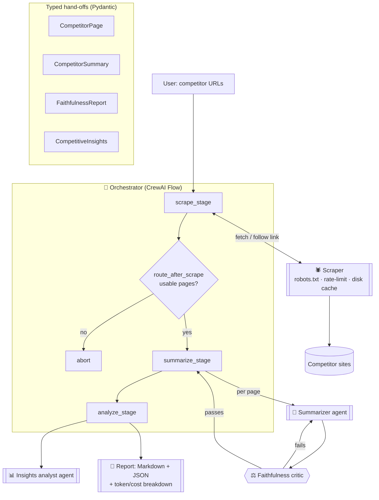

# 🔎 Competitor Intelligence Crew

A [CrewAI](https://docs.crewai.com/)-based multi-agent system that turns a handful
of competitor URLs into a **structured, source-faithful comparison** of pricing,
features, and positioning.

Give it a few competitor links; get back a Markdown/JSON report with a side-by-side
comparison table, differentiators, market gaps, and a recommendation — plus a
per-run token/cost breakdown and a log of the decisions the orchestrator made.

> This is a compact, demo-sized but production-minded scaffold: typed inter-agent
> outputs, a real orchestrator decision loop, a faithfulness evaluator, polite
> cached scraping, cost tracking, a web UI, Docker, and offline tests.

---

## Why it's not just a sequential chain

The orchestrator (a CrewAI **Flow**) makes real run-time decisions instead of
blindly piping one agent into the next:

- **Which page to scrape.** If a landing page is thin or junk, it follows the most
  relevant internal link (e.g. `/pricing`) instead — up to a configurable number
  of attempts.
- **Whether a summary is trustworthy.** Every summary is checked by a
  faithfulness critic (LLM-as-judge). If it fails, the summary is sent back for
  revision *with the critic's feedback*, up to a configurable number of retries.
- **Whether there's enough to analyze.** A `@router` aborts gracefully when no
  page yields usable content.

Every agent hand-off is a **typed Pydantic model** (`CompetitorPage`,
`CompetitorSummary`, `FaithfulnessReport`, `CompetitiveInsights`), so decisions
are made on structured fields, not free text.

## Architecture



**Agents & components**

| Component | Role | LLM? |
| --- | --- | --- |
| **Orchestrator** (`flow.py`) | Decision-maker: routing, re-scrape & revision loops | no (drives the others) |
| **Scraper** (`scraper.py`) | Fetch + clean pages, robots.txt, rate-limit, disk cache | no (deterministic) |
| **Summarizer** (`crew.py`) | Extract structured pricing/features/positioning | yes |
| **Faithfulness critic** (`crew.py`) | Score how grounded a summary is; drive revisions | yes |
| **Insights analyst** (`crew.py`) | Synthesize the cross-competitor comparison | yes |

## Quickstart (local)

Requires **Python 3.11+**. This project uses [`uv`](https://docs.astral.sh/uv/)
in examples, but plain `pip` works too.

```bash
# 1. Install
uv venv && source .venv/bin/activate
uv pip install -e ".[dev,ui]"      # or: pip install -e ".[dev,ui]"

# 2. Configure your LLM key
cp .env.example .env
# edit .env and set ANTHROPIC_API_KEY=... (default) or switch to OpenAI

# 3. Run the CLI
competitor-intel run \
  --url https://competitor-a.com/pricing \
  --url https://competitor-b.com/pricing \
  --output reports

# 4. Or launch the web UI
streamlit run app/streamlit_app.py
```

The report is written to `reports/report.md` and `reports/report.json`.

## Quickstart (Docker)

```bash
cp .env.example .env   # set your API key
docker compose up --build
# open http://localhost:8501 for the Streamlit UI
```

To run the CLI in the container instead of the UI:

```bash
docker compose run --rm competitor-intel \
  competitor-intel run --url https://competitor-a.com/pricing
```

## Example output

```markdown
# Competitor Intelligence Report

- **Seed URLs:** https://acme.example.com/pricing, https://beta.example.com/
- **Model:** `claude-sonnet-4-5` | **Tokens:** 11,100 | **Est. cost:** $0.0585

## Comparison

| Competitor | Entry price | Positioning | Standout features |
| --- | --- | --- | --- |
| Acme Analytics | $29/mo | Analytics for fast-growing SaaS teams | real-time dashboards, no-code funnels, warehouse sync |
| BetaBoard | $0 (Free) / $12 per user | Simple kanban for remote engineers | real-time boards, roadmap views, GitHub/Slack |

## Recommendation

Target teams that outgrow BetaBoard's simplicity but find Acme's analytics
overkill: offer a mid-market bundle with a generous free tier and one-click
integrations.

## Orchestrator decision log

- scrape: 'https://acme.example.com/pricing' usable on attempt 1
- scrape: 'https://beta.example.com/' thin; following 'https://beta.example.com/pricing' instead
- scrape: 'https://beta.example.com/pricing' usable on attempt 2
- route: 2/2 pages usable - proceeding
- summary: '.../pricing' passed faithfulness (score=0.93) on attempt 1
- analysis: synthesised insights from 2 summaries
```

The JSON report contains the full typed objects (pages, summaries, faithfulness
reports, insights, and the cost breakdown) for downstream tooling.

## Configuration

All configuration is via environment variables (see [`.env.example`](.env.example)).
Secrets are **never** committed.

| Variable | Default | Description |
| --- | --- | --- |
| `LLM_PROVIDER` | `anthropic` | `anthropic` or `openai` |
| `LLM_MODEL` | `claude-sonnet-4-5` | Model id (or provider-qualified, e.g. `openai/gpt-4o-mini`) |
| `LLM_TEMPERATURE` | `0.2` | Sampling temperature |
| `ANTHROPIC_API_KEY` / `OPENAI_API_KEY` | – | Provider API key (pick the one you use) |
| `SCRAPER_RESPECT_ROBOTS` | `true` | Honor `robots.txt` |
| `SCRAPER_RPS` | `1.0` | Max requests/second per host |
| `SCRAPE_CACHE_ENABLED` | `true` | On-disk cache so dev never re-scrapes |
| `MIN_CONTENT_WORDS` | `120` | Below this, a page is "thin" and triggers a follow-link |
| `MAX_SCRAPE_ATTEMPTS` | `2` | Re-scrape / follow-link budget per seed |
| `FAITHFULNESS_THRESHOLD` | `0.7` | Minimum faithfulness score to accept a summary |
| `MAX_REVISION_ATTEMPTS` | `2` | Summary revision budget per page |

Switch to OpenAI with, e.g.:

```bash
LLM_PROVIDER=openai
LLM_MODEL=gpt-4o-mini
OPENAI_API_KEY=sk-...
```

## Development

```bash
uv pip install -e ".[dev]"
ruff check .          # lint
ruff format .         # format
pytest -q             # tests (fully offline: mocked HTTP + fake LLM services)
```

Tests never hit the network or an LLM: HTTP is mocked with `httpx.MockTransport`
against small HTML fixtures in `tests/fixtures/`, and the LLM-backed agents are
replaced with typed fakes. CI (GitHub Actions) runs lint + tests on Python 3.11
and 3.12.

### Project layout

```
src/competitor_intel/
  models.py      # Pydantic models for every inter-agent output
  config.py      # env-driven configuration + model pricing table
  cache.py       # TTL'd on-disk scrape cache
  scraper.py     # polite, cached HTML fetch + clean
  quality.py     # pure decision helpers (junk detection, link follow, thresholds)
  crew.py        # CrewAI Agents/Tasks/Crews -> typed services
  flow.py        # the orchestrator (CrewAI Flow) with the decision loops
  cost.py        # per-run token/cost tracking
  report.py      # Markdown + JSON rendering
  runner.py      # config -> services -> flow -> report
  cli.py         # `competitor-intel run ...`
app/streamlit_app.py   # web UI
```

## Roadmap

- Persistent change-tracking memory across runs (diff a competitor over time)
- Screenshot + visual diffing of pricing pages
- Richer scraping (sitemap crawl, JS rendering for SPA sites)
- Pluggable evaluators and additional judge models
- Hosted deployment + scheduled runs

## License

[MIT](LICENSE)
